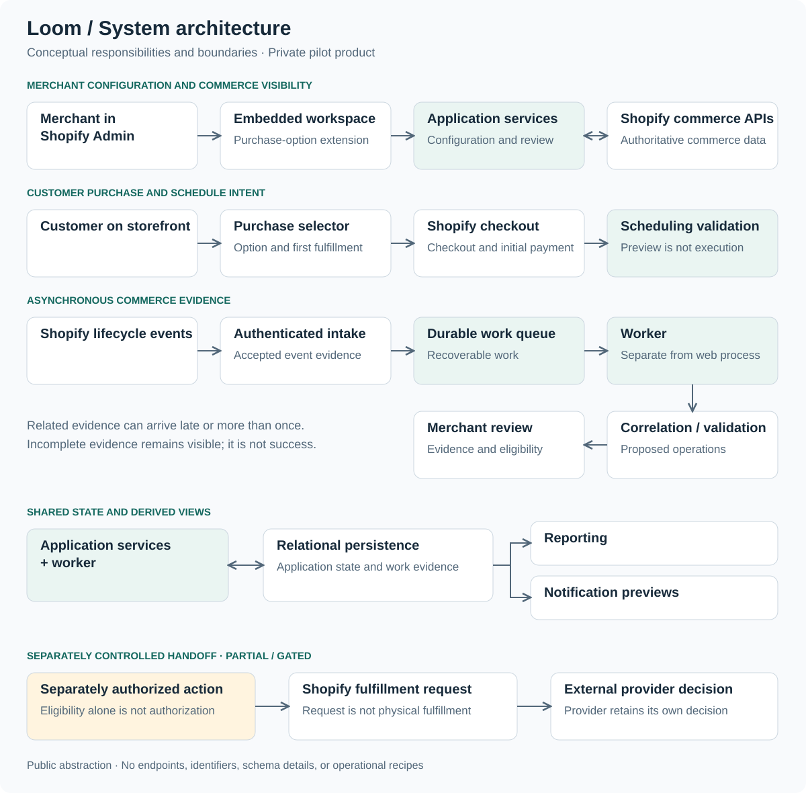

# Loom™

### Subscription Commerce Platform

**McHenry Power · Product Architect & Full-Stack Developer**

Loom™ is a private-pilot Shopify subscription commerce platform I independently designed and built end-to-end, spanning purchase configuration, storefront experience, asynchronous subscription operations, fulfillment scheduling, analytics, and merchant tooling.

**Status:** Private pilot with a small cohort of partner businesses for testing, feedback, and telemetry. 
**Source:** Proprietary production code; public technical case study.

**Core technologies:** TypeScript · Node.js · React · Shopify Admin GraphQL · Prisma · PostgreSQL

[Product Gallery](docs/product-gallery.md) · [Architecture](docs/architecture.md) · [Engineering Decisions](docs/engineering-decisions.md) · [Validation](docs/testing-validation.md)

## What Loom solves

Subscription commerce connects records and actions that do not advance together. Purchase settings change while remote selling plans must retain identity. Order and contract events arrive separately. One payment can fund multiple deliveries, and a requested delivery date is not a billing date.

Loom brings configuration, commerce evidence, and proposed operations into a merchant workspace. The engineering work centers on preserving identity, correlating asynchronous state, explaining incomplete evidence, and controlling external side effects.

## What this project demonstrates

- **0→1 product ownership.** I carried the product from architecture and UX through backend systems, data modeling, testing, and operational workflows.
- **Systems engineering.** I designed for duplicate and out-of-order events, idempotency, state reconciliation, deterministic scheduling, and guarded external actions.
- **Product judgment.** Merchant workflows shaped purchase configuration, commerce investigation, and fulfillment review.
- **Production discipline.** Runtime separation, bounded evidence, recoverable work, and controlled side effects inform validation and readiness.

## What exists today

The private pilot implements four connected areas:

- **Purchase configuration and selection.** Product-level options support native one-time purchases, pay-per-order subscriptions, and prepaid recurring or finite structures. Stable selling-plan identity supports selective updates; the storefront supports purchase selection, first fulfillment, and schedule preview.
- **Commerce visibility.** Durable event processing correlates orders, contracts, and lines. Contract detail, reconciliation and audit views, unified order browsing, and exact lookup support investigation when related evidence arrives at different times.
- **Scheduling and operational review.** A dashboard and simulator expose proposed schedules, with lead-time, cutoff, blackout, horizon, and timezone validation. Fulfillment-group review establishes eligibility; submission and rescheduling remain controlled or gated. Cancellation categorization applies to already-canceled contracts.
- **Reporting and readiness.** Bounded analytics, saved views, custom arithmetic metrics, and PDF / spreadsheet / CSV exports support merchant analysis. Health and capability coverage expose readiness; notification previews do not imply delivered notifications.

The [product overview](docs/product-overview.md) explains the workflow, and the [maturity matrix](docs/roadmap.md) separates implemented scope from partial, gated, preview, and planned work.

## Engineering decisions

| Challenge | Approach | Read more |
| --- | --- | --- |
| Preserve selling-plan identity as configuration changes | Compare desired and observed state, retain unambiguous identity, and update selectively. | [Stable identity](docs/engineering-decisions.md#stable-selling-plan-identity) |
| Handle duplicate and out-of-order events | Preserve work durably, expose missing dependencies, and keep processing recoverable. | [Asynchronous correlation](docs/engineering-decisions.md#asynchronous-commerce-events) |
| Guard consequential external actions | Separate eligibility, authorization, and outcome evidence; reconcile unknown results before retrying. | [Safety and recovery](docs/reliability-and-recovery.md) |
| Explain analytics coverage and degraded states | Distinguish missing evidence from zero, retain retrieval scope, and make limitations readable to merchants. | [Bounded evidence](docs/engineering-decisions.md#analytics-with-bounded-evidence) |
| Make scheduling deterministic | Evaluate explicit time context and calendar constraints separately from external actions. | [Scheduling tradeoffs](docs/engineering-decisions.md#deterministic-scheduling) |

## Product direction

The images explore **possible future-state interfaces using demonstration data**, informed by Loom's architecture and roadmap. The pilot's implemented scope is documented above and in the [maturity matrix](docs/roadmap.md).

Purchase Options places configurable purchase structures beside a storefront preview, connecting merchant settings with customer choices. Its AI-assisted configuration panel is future direction.

*Possible future-state interface.*

[Open full-resolution image](screenshots/02-purchase-options.png) · [Explore all seven interfaces](docs/product-gallery.md)

## System architecture

Separate web and worker processes support interactive workflows and durable event processing. Workers correlate commerce evidence and validate proposed operations for review, sharing relational persistence with application services. Development uses SQLite; production mode uses PostgreSQL.

Shopify remains authoritative for its commerce records. Payment, scheduling intent, and physical fulfillment have separate meanings. Eligibility is not authorization, a preview is not execution, and an uncertain remote outcome cannot safely be treated as rejection.

Read the [architecture and technology stack](docs/architecture.md) or follow the [subscription lifecycle](docs/product-overview.md#from-configuration-to-operational-review).

## More interface concepts

These views extend the product direction above. AI insights, external performance signals, automated delivery, and pictured integrations remain future-state proposals.

Orders &amp; Activity — operational context

This view would bring order evidence, payment state, and fulfillment review together. Release indicators depict a controlled review path; automatic provider release remains outside current scope.

*Possible future-state interface.*

[Open full-resolution image](screenshots/01-orders-activity.png)

Analytics Overview — metrics and investigation

This concept would pair report scope and subscription metrics with suggested investigations. Generated insights, website-performance signals, and insight tasks remain future direction; displayed figures are demonstration data.

*Possible future-state interface.*

[Open full-resolution image](screenshots/04-analytics-overview.png)

Automations — report delivery and review

This concept would coordinate scheduled reports, alerts, and AI briefings. Automated multi-format delivery and the pictured communication integrations are future-state proposals, distinct from current on-demand exports.

*Possible future-state interface.*

[Open full-resolution image](screenshots/06-automations.png)

[View the complete seven-image gallery](docs/product-gallery.md), including Scheduling, Custom Reports, and Loom AI™.

## Validation

Validation spans domain logic, local persistence/concurrency scenarios, mocked Shopify integrations, browser regressions, and runtime/configuration checks.

Responsive interaction, accessibility checks, build, TypeScript, and lint checks complement these layers. [Methodology and evidence boundaries](docs/testing-validation.md) distinguish application validation from this repository's local presentation checks.

## My contribution

I independently designed and developed Loom using AI-assisted development tooling, owning the product architecture, Shopify integration, full-stack implementation, merchant UX, domain modeling, operational workflows, analytics, validation, and runtime preparation.

The work spans product and systems engineering: translating merchant workflows into software while designing for asynchronous state, incomplete evidence, recoverability, and controlled external actions.

## Explore further

- [Desired-state catalog update](examples/desired-state-update.md): preserve identity and surface ambiguity.
- [Durable event processing](examples/durable-event-processing.md): reason about duplicate evidence and recoverable work.
- [Uncertain external outcomes](examples/uncertain-outcome-pattern.md): separate confirmation, rejection, and uncertainty.
- [All six reconstructed examples](examples/README.md): includes calendar validation, billing versus delivery, and bounded lookup.

These are independently reconstructed educational examples using fictional data and pseudocode, not production source or an executable Loom application. The [roadmap](docs/roadmap.md) records capability boundaries and future direction.

Production source remains proprietary and private. For a conversation about the product and engineering work, connect with [McHenry Power on LinkedIn](https://www.linkedin.com/in/mchenry-j-power-mba).
