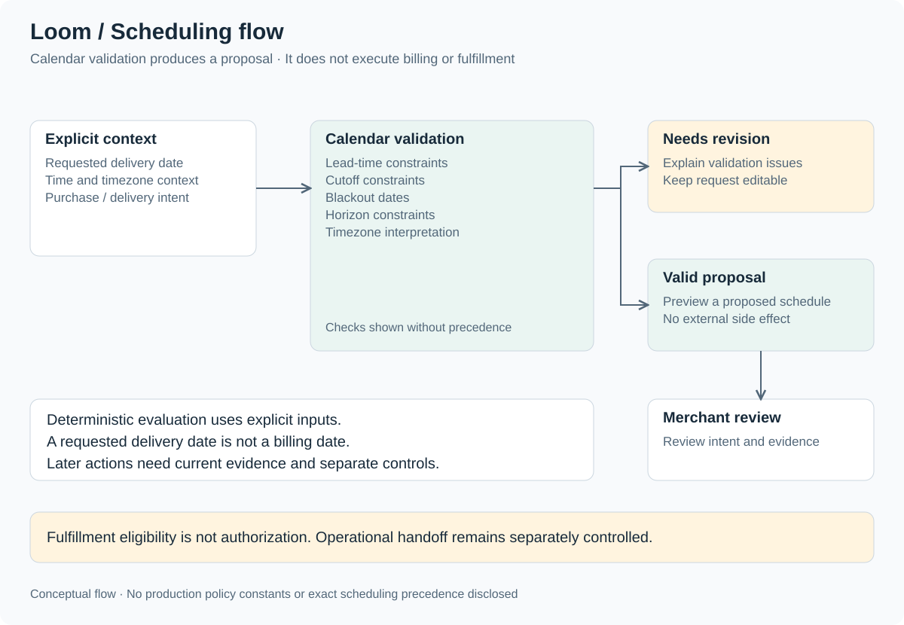

# Architecture

[Return to case study](../README.md)

The architecture separates merchant interaction, customer selection, asynchronous commerce evidence, and externally consequential actions. This is a conceptual account, not a deployment topology or implementation specification.

## Surfaces and responsibilities

| Boundary | Responsibility | Constraint |
| --- | --- | --- |
| Shopify Admin → embedded workspace / purchase-option extension | Merchant configuration, commerce visibility, operational review | Available data and actions depend on permissions and capability coverage. |
| Storefront → selector → Shopify checkout → scheduling validation | Purchase choice, initial checkout/payment, requested schedule validation | A preview describes intent; it does not execute billing or fulfillment. |
| Application services ↔ Shopify commerce APIs | Read authoritative commerce evidence and support controlled synchronization | Local state does not replace Shopify's authority over its records. |
| Lifecycle events → authenticated intake → durable queue → worker | Preserve work across asynchronous arrival and support recoverable processing | Arrival order and duplicate delivery cannot be treated as business truth. |
| Worker → correlation / validation / proposed operations → review | Join available order, contract, and line evidence and expose actionable state | Incomplete dependencies remain explicit; correlation mechanics are private. |
| Services + worker ↔ relational persistence | Maintain application state and durable operational evidence | This case study does not publish schemas, lock design, or deduplication mechanics. |
| Services + worker → reporting / notification previews | Produce bounded reports and preview content | Coverage limits remain visible; previews do not imply delivery. |
| Separately authorized action → Shopify fulfillment request → provider decision | Controlled external handoff | Provider acceptance and physical fulfillment are distinct from submitting a request. |

## Runtime and persistence

Separate web and worker processes allow interactive requests and asynchronous work to have distinct execution responsibilities. Prisma supports relational persistence, with SQLite for development and PostgreSQL for production mode. The choice creates an explicit validation obligation: local behavior cannot by itself establish production-mode concurrency or runtime readiness.

Environment-aware preparation covers runtime and configuration validation. It is not a claim of production-scale certification. No environment values, deployment commands, or production topology are published here.

## Stable identity and reconciliation

Product-level configuration expresses desired purchase options. Stable selling-plan identity and selective updates reduce unnecessary resource replacement. A public-safe reconciliation model compares intended and observed state, preserves unambiguous identity, and surfaces ambiguity for review. It does not reveal matching rules, resource identifiers, or remote mutation recipes.

## Scheduling as a domain boundary

Calendar validation considers a requested date, relevant timezone context, and lead-time, cutoff, blackout, and horizon constraints. These are presented as a set of checks, **not Loom's exact precedence or algorithm**. Deterministic evaluation needs explicit time context so that equivalent inputs can be reasoned about consistently.

Schedule proposals and simulations are read as intent. Billing evidence belongs to financial records; requested delivery dates belong to physical-delivery planning. The [billing versus delivery example](../examples/billing-vs-delivery.md) illustrates this distinction without reproducing a production model.

## Evidence and action boundaries

Authenticated event intake and durable processing support evidence collection. External action safety is a separate concern: eligibility does not confer authorization, and a request timeout does not establish rejection. A readable unknown state is necessary when the remote result cannot be established.

See [engineering decisions](engineering-decisions.md) for tradeoffs and [reliability and recovery](reliability-and-recovery.md) for the public safety model.

## Technology stack

The documented build uses the following technologies. The [product-direction gallery](product-gallery.md) does not establish additional integrations or AI infrastructure.

| Layer | Technologies |
| --- | --- |
| Application | Node.js, TypeScript, JavaScript, React Router, Vite |
| Merchant UI | React, Shopify App Bridge, Shopify UI / Polaris conventions, CSS / CSS Modules, semantic HTML |
| Shopify integration | Admin GraphQL, UI Extensions, Preact for the Admin extension, Liquid theme app extension, authenticated webhooks and app proxy, persistent Shopify sessions, Shopify CLI |
| Persistence | Prisma; SQLite for development; PostgreSQL for production mode |
| Validation | Node test runner, tsx, Playwright, Chromium, axe-core, local fixtures, mocked Shopify responses |
| Reporting | ExcelJS, pdf-lib, CSV generation |
| Runtime and tooling | Separate web and worker processes, npm workspaces, TypeScript compiler, ESLint, esbuild, Git |
