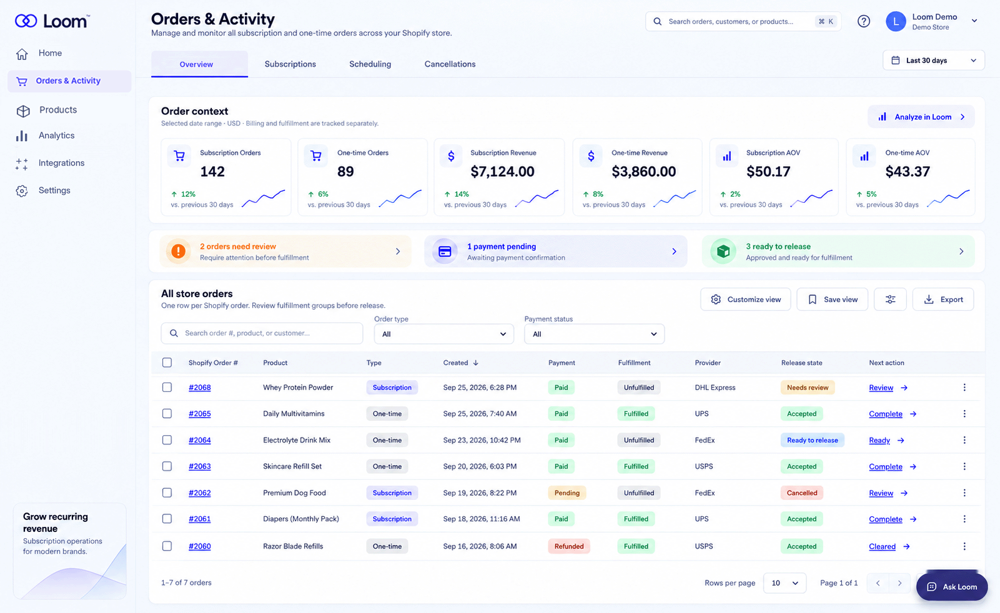
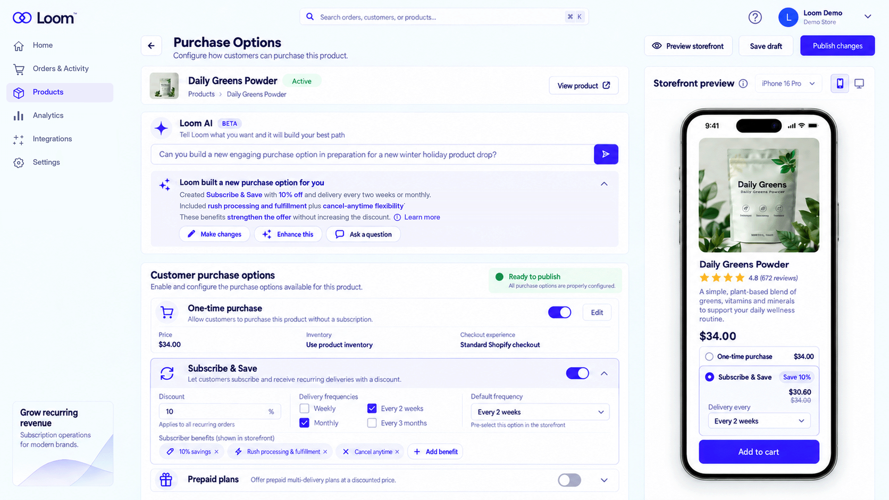
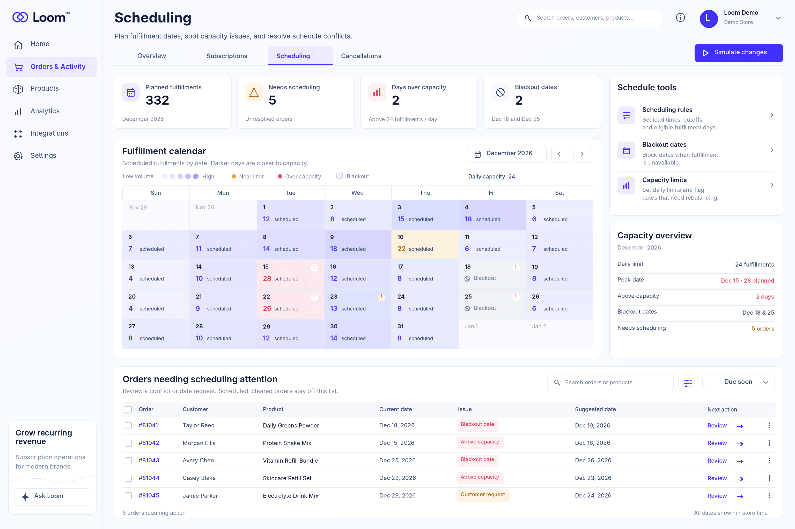
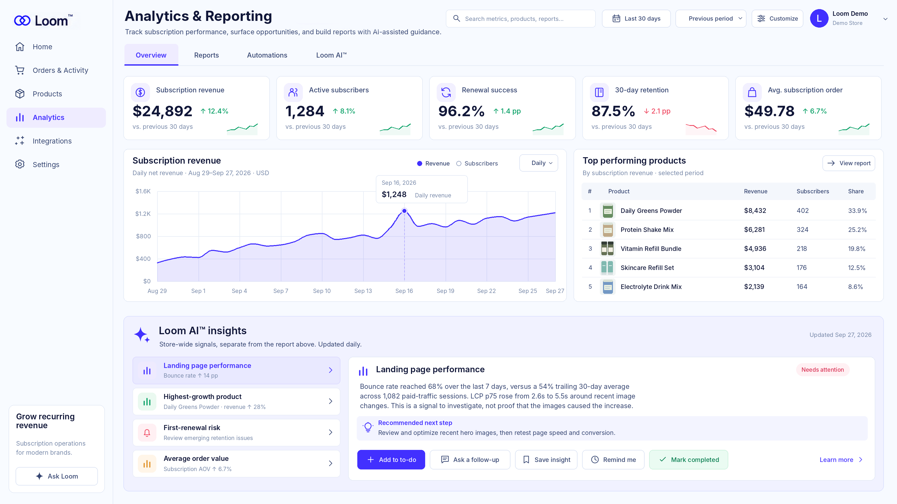
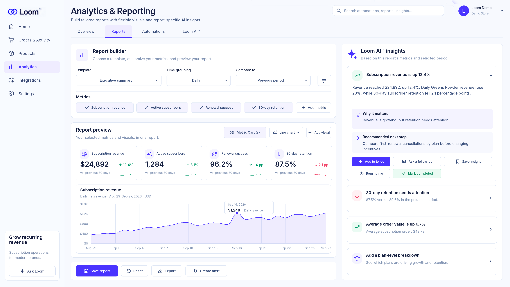
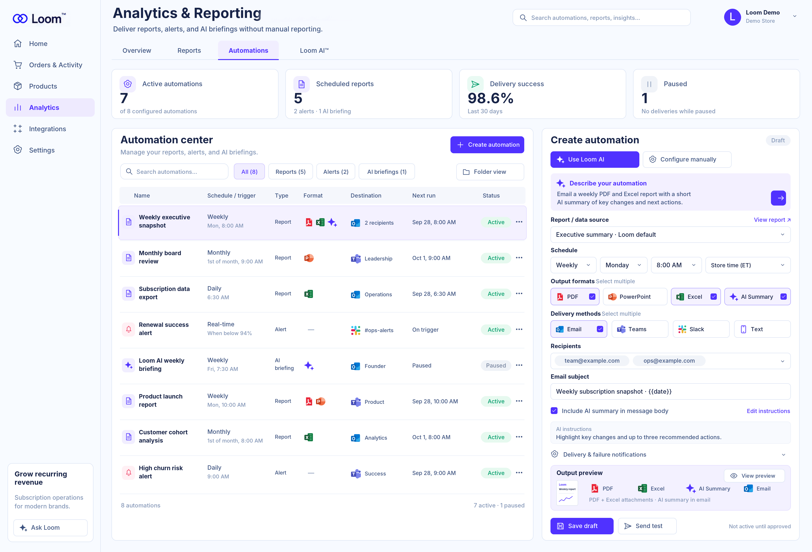
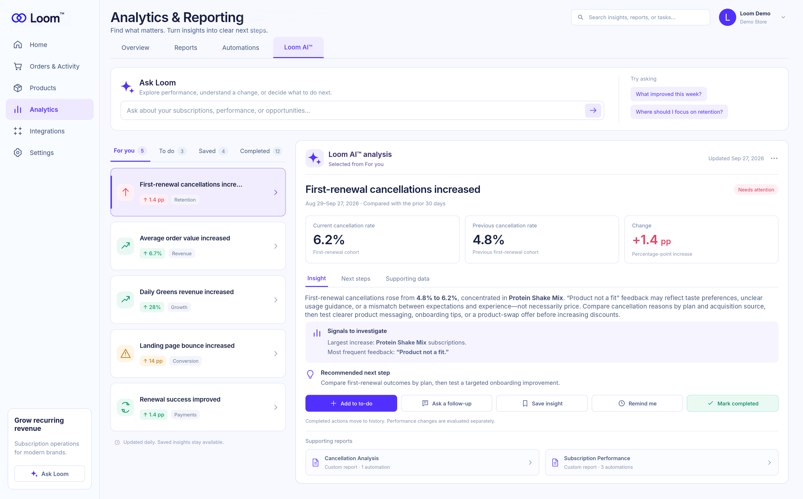

# Product gallery

[Return to case study](../README.md) · [Implemented capabilities](product-overview.md) · [Maturity and roadmap](roadmap.md)

These seven owner-approved presentation exports explore possible future-state interfaces using demonstration data. They describe product direction, not a catalog of currently shipped features. Dashboard figures are illustrative, not evidence of revenue, adoption, performance, or customer outcomes.

The documented private pilot and these interface concepts are separate evidence layers. In particular, AI-assisted configuration, generated insights, external website-performance signals, automated multi-format report delivery, pictured integrations, and insight task management remain future direction.

Each image links to its original full-resolution PNG. Open the original to inspect small interface text.

## Browse the gallery

[01 — Orders & Activity](#01--orders--activity) · [02 — Purchase Options](#02--purchase-options) · [03 — Scheduling](#03--scheduling) · [04 — Analytics Overview](#04--analytics-overview) · [05 — Custom Reports](#05--custom-reports) · [06 — Automations](#06--automations) · [07 — Loom AI™](#07--loom-ai)

The intended navigation has six main areas: Home, Orders & Activity, Products, Analytics, Integrations, and Settings. Orders & Activity contains Overview, Subscriptions, Scheduling, and Cancellations; Analytics contains Overview, Reports, Automations, and Loom AI™. Purchase Options belongs to Products. Navigation labels describe the design organization, not implementation status.

## 01 — Orders & Activity

This concept would help merchants inspect subscription and one-time order activity alongside payment evidence and fulfillment review. Separate payment, fulfillment, and release states would preserve the distinction between commerce evidence and a controlled operational action.

*Possible future-state interface.*

[Open full-resolution PNG](../screenshots/01-orders-activity.png) · [Reliability and external-action safety](reliability-and-recovery.md) · [Gallery index](#browse-the-gallery)

## 02 — Purchase Options

Within Products, this concept would place configurable purchase structures beside a storefront preview so merchants could inspect how their settings affect customer choice. The AI configuration panel and suggested benefits are product direction, not evidence of implemented AI assistance or broader customer lifecycle controls.

*Possible future-state interface.*

[Open full-resolution PNG](../screenshots/02-purchase-options.png) · [Stable selling-plan identity](engineering-decisions.md#stable-selling-plan-identity) · [Gallery index](#browse-the-gallery)

## 03 — Scheduling

Within Orders & Activity, this concept would combine proposed fulfillment dates, blackout context, capacity signals, and requests needing attention. It explores how merchants might investigate conflicts; the pictured capacity controls and suggested date changes do not establish unrestricted rescheduling or automatic execution.

*Possible future-state interface.*

[Open full-resolution PNG](../screenshots/03-scheduling.png) · [Scheduling domain boundaries](architecture.md#scheduling-as-a-domain-boundary) · [Gallery index](#browse-the-gallery)

## 04 — Analytics Overview

This concept would pair scoped subscription metrics with product trends and suggested investigations. Generated insights, external website-performance signals, and follow-up tasks are future direction; the design would need to keep those signals distinct from the report's own evidence.

*Possible future-state interface.*

[Open full-resolution PNG](../screenshots/04-analytics-overview.png) · [Analytics with bounded evidence](engineering-decisions.md#analytics-with-bounded-evidence) · [Gallery index](#browse-the-gallery)

## 05 — Custom Reports

Within Analytics → Reports, this concept would let merchants assemble metrics and visuals around a specific reporting question. The adjacent AI interpretation and follow-up controls explore how a report might support investigation; their presence does not establish delivered insight generation or task management.

*Possible future-state interface.*

[Open full-resolution PNG](../screenshots/05-custom-reports.png) · [Bounded browse versus explicit lookup](../examples/bounded-browse-vs-lookup.md) · [Gallery index](#browse-the-gallery)

## 06 — Automations

Within Analytics → Automations, this concept would coordinate report schedules, alerts, AI briefings, and delivery destinations. Automated multi-format delivery and the pictured integrations remain future-state proposals, distinct from the pilot's on-demand PDF, spreadsheet, and CSV exports.

*Possible future-state interface.*

[Open full-resolution PNG](../screenshots/06-automations.png) · [Delivery and automation maturity](roadmap.md#partial-gated-preview-or-roadmap-work) · [Gallery index](#browse-the-gallery)

## 07 — Loom AI™

Within Analytics → Loom AI™, this concept would organize merchant questions, suggested investigations, and follow-up tasks. Generated explanations and recommendations are future direction; completing a task would not itself prove a change in business performance.

*Possible future-state interface.*

[Open full-resolution PNG](../screenshots/07-loom-ai.png) · [Evidence and missing-data distinctions](product-overview.md#domain-distinctions-that-shape-the-product) · [Gallery index](#browse-the-gallery)

---

[Return to case study](../README.md) · [Asset index](../screenshots/README.md)
