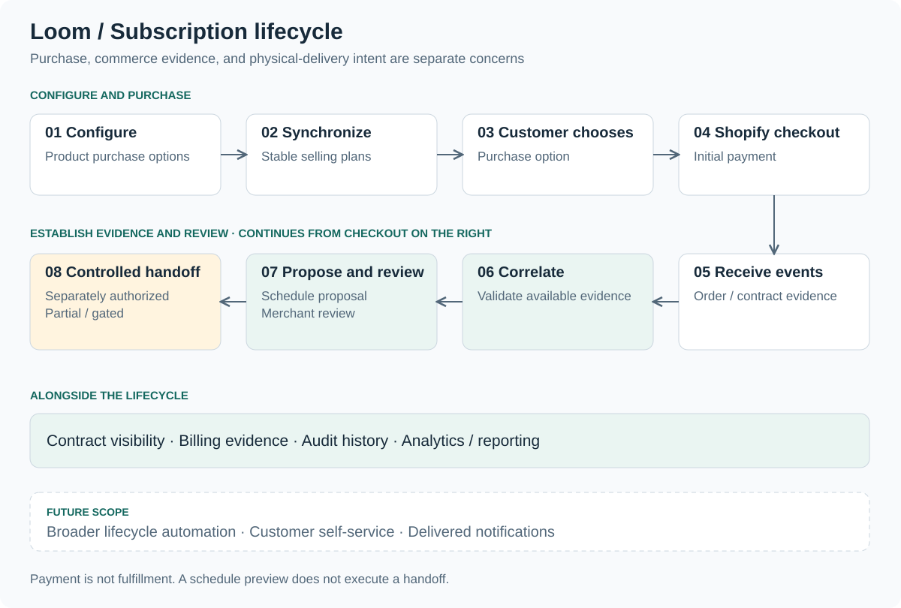

# Product overview

[Return to case study](../README.md)

Loom™ is a Shopify subscription commerce platform connecting purchase-option configuration, storefront selection, subscription visibility, scheduling, merchant operations, analytics, and controlled lifecycle workflows.

**Private pilot product available internally and to a small cohort of partner businesses for pilot testing, feedback, and telemetry.** It is not generally available. McHenry Power independently designed and developed the product as Product Architect & Full-Stack Developer, using AI-assisted development tooling.

## From configuration to operational review

1. **Configure purchase options.** A merchant configures product-level purchase options and synchronizes selling plans. Native one-time purchase, pay-per-order subscriptions, prepaid recurring subscriptions, and prepaid finite / one-time structures have different billing and delivery implications. Delivery cadences include weekly, biweekly, and monthly.
2. **Select on the storefront.** The customer chooses a purchase option and first fulfillment, with a schedule preview. Calendar validation considers lead time, cutoff, blackout, horizon, and timezone constraints. Shopify checkout handles checkout and initial payment.
3. **Establish commerce evidence.** Order, contract, and line evidence can become available at different times. Durable event processing supports correlation and validation without assuming a single arrival sequence.
4. **Review proposed operations.** The scheduling dashboard and simulator expose schedule intent. Contract registry, canonical contract detail, reconciliation views, and audit history support investigation. Fulfillment-group review establishes eligibility; handoff is separately controlled.
5. **Understand the available picture.** Unified order browsing and exact lookup support investigation. Bounded reporting, saved views, arithmetic metrics, and exports make coverage visible. Merchant health / capability coverage and notification previews expose readiness and preview behavior.

## Domain distinctions that shape the product

| Distinction | Practical implication |
| --- | --- |
| Payment is not fulfillment | Financial evidence alone does not prove that goods were delivered or authorize their release. |
| Requested delivery date is not billing date | A customer's delivery request cannot be used as evidence of when a charge occurred. |
| Schedule preview is not execution | Simulating a schedule must not be presented as a completed operational action. |
| Fulfillment eligibility is not authorization | Passing checks does not itself initiate an external handoff. |
| Missing evidence is not zero or success | Reports and workflows need explicit unavailable, incomplete, and unknown states. |
| Remote side effects are not automatically reversible | A local correction cannot be assumed to undo a remote action. |
| Shopify is authoritative for its commerce records | Local views and projections need reconciliation against the commerce evidence they represent. |

## Operational visibility and scope

Cancellation reason categorization applies to **already-canceled contracts**. It should not be mistaken for a general cancellation or contract-mutation capability. Notification previews show intended content; they do not establish delivered notification infrastructure.

Fulfillment rescheduling, controlled submission, and rollback / recovery belong to partial or gated work. Loom does not claim complete autonomous recurring billing, automatic fulfillment-provider release, or complete subscription lifecycle automation. The [roadmap](roadmap.md) gives the public maturity boundary for every named future area.

## Evidence in this case study

The architectural account and validation methodology use the approved public-safe product description. Diagrams are conceptual; examples are independently reconstructed. The [product gallery](product-gallery.md) contains seven owner-approved possible future-state interfaces with demonstration data. These visuals explore product direction and do not independently verify the pilot's implementation or the availability of pictured AI, automation, integrations, or customer workflows.
