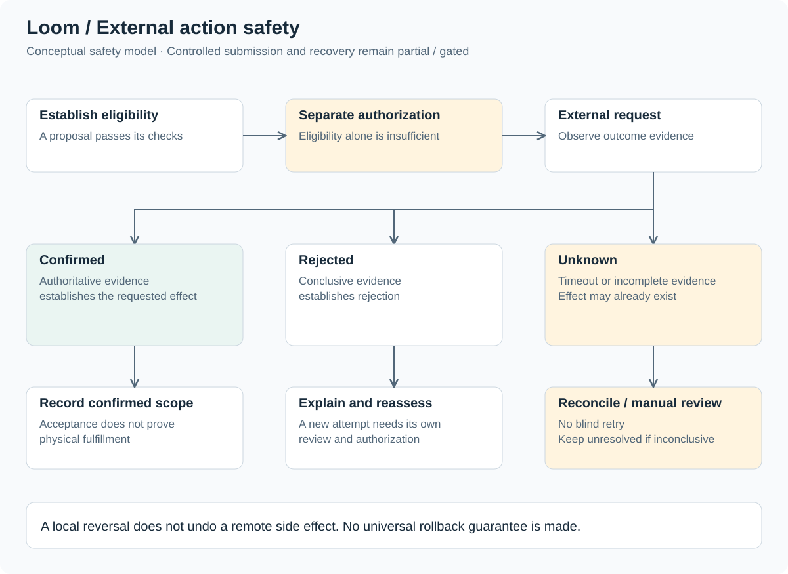

# Reliability and recovery

[Return to case study](../README.md)

Reliability requires distinguishing delayed evidence, failed local work, and uncertain remote effects. These conditions call for different responses. This document describes the public safety model; it does not claim complete lifecycle automation or production-proven rollback.

## Durable work and incomplete evidence

Authenticated lifecycle events enter durable processing. A separate worker supports correlation, validation, and proposed operations. Related commerce evidence may be delayed or arrive in a different sequence; duplicate events must not imply duplicate business effects.

| Condition | Interpretation | Public-safe handling principle |
| --- | --- | --- |
| Duplicate event | Previously seen evidence may arrive again | Preserve an equivalent business result; do not infer a new action solely from another delivery. |
| Missing order / contract dependency | Evidence is incomplete | Keep unresolved work visible and reconsider when evidence becomes available. |
| Interrupted local work | Local processing may be incomplete | Recover against durable state and examine prior progress. |
| Restricted data access | The application may lack necessary evidence | Explain capability coverage; do not present an empty response as a universal absence. |
| Uncertain remote result | A side effect may already have occurred | Reconcile before considering another consequential request. |

The implementation of correlation keys, deduplication, locking, and recovery scheduling is deliberately excluded. The [durable-event example](../examples/durable-event-processing.md) is a behavioral contract, not a queue implementation.

## External action safety

Eligibility answers whether a proposal satisfies its checks. Authorization answers whether the action may proceed. Neither establishes that a provider accepted a request or that physical fulfillment occurred.

| Outcome | Evidence interpretation | Next principle |
| --- | --- | --- |
| Confirmed | Authoritative evidence establishes the specific requested effect | Record only the scope actually confirmed; request acceptance is not proof of delivery. |
| Rejected | Conclusive evidence establishes rejection | Explain the reason and reassess before a newly authorized action. |
| Unknown | A timeout or incomplete response leaves the effect unresolved | Preserve uncertainty, avoid blind retry, and reconcile with authoritative evidence or manual review. |

A transport error alone does not prove rejection. A local status change does not undo a remote side effect. Recovery may require investigation, a separately supported compensating action, or leaving the case unresolved. No universal rollback guarantee is made.

## Merchant-readable degraded states

Contract detail, reconciliation / audit views, and merchant health / capability coverage provide the current diagnostic surfaces. Public-safe recovery UX should make three things legible: the evidence available, the limitation preventing progress, and the kind of next step needed.

Illustrative language includes “waiting for related evidence,” “data unavailable with current access,” and “remote result requires review.” These phrases are design examples, not transcriptions of the production interface. Auditability should preserve the difference between an observation, a proposal, and a confirmed outcome.

## What remains bounded

Fulfillment rescheduling, controlled submission, and rollback / recovery are partial or gated. Automatic fulfillment-provider release and complete autonomous recurring billing are not current completed capabilities. A notification preview does not establish that delivery infrastructure exists.

Validation covers local persistence / concurrency scenarios and mocked integration failure conditions alongside domain and browser checks. It is not production stress testing or complete live end-to-end validation. See [testing and validation](testing-validation.md) and [roadmap](roadmap.md).
